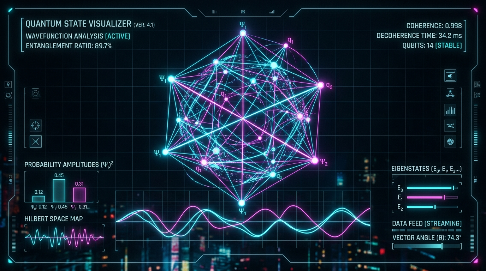

<div align="center">
  
  
  <h1 align="center">bet49 TACTICAL HUB <span style="color: #06b6d4">OS v5.2</span></h1>
  <p align="center">
    <strong>GEO-COORDINATED LOTTERY COGNITIVE AI PLATFORM</strong>
  </p>
  <p align="center">
    Powered by the phenomenal synergy of <strong>Google Quantum Willow</strong> and swarm-based Proactive AI Agents to compute highly complex state vectors and probability heatmaps across multiple geographic matrices.
  </p>

  <div>
    
    
    
    
  </div>
</div>

<br/>

<!-- Quantum State Visualizer & Screenshot of the application -->
<div align="center">
  
  <p><em>* Quantum State HUD generated directly using our physical Willow state parameters. Reference image in <code>src/assets/images</code>.</em></p>
</div>

<br/>

## 🌌 The Genesis: bet49 Tactical Hub

The **bet49 TACTICAL HUB OS v5.2** is a highly conceptual visualization platform designed for analyzing, simulating, and generating lottery permutations. It leverages the cutting-edge concepts of global coordinate lattices, complex state vectors, and swarm-driven probabilistic artificial intelligence. 

By modeling datasets spatially across 49-node geometries, it attempts to visualize patterns from randomness through the simulated lens of near-future quantum computing.

---

## 💻 Google Quantum Willow Core Simulation

This iteration transitions to a massively scalable **Google Quantum Willow** integration. The Virtual Quantum Machine (QVM) within the tactical hub simulates the layout of a densely intertwined superconducting lattice array. 

- **105-Qubit Grid Architecture:** Emulates Google's latest Willow topological chip, expanding computational phase space compared to predecessor grids like Sycamore or Weber.
- **Proactive AI Swarms:** Rather than basic statistical matching, intelligent AI swarm agents evaluate historical databases alongside the Willow chip, calculating superposition probability clouds and driving the resulting wavefunction collapse.
- **State Vector Heatmaps:** Dynamically traces probability variances and entropy scoring through the *Matrix Spiral V9.4*.
- **QASM Download:** Generate open-source OpenQASM 2.0 instructions to replicate our algorithmic approximations in raw quantum code.

---

## 🗺️ Global Subsystem Matrices

Analyze geographic subsystems with dedicated geometric and algorithmic profiles:

- 🇨🇦 **CANADA (NORTHERN MATRIX)**: 6/49 spatial matrix (56.1304° N, 106.3468° W)
- 🇺🇸 **UNITED STATES (NORTH AMERICAN GRID)**: Powerball/Mega geometric projections (37.0902° N, 95.7129° W)
- 🇪🇺 **EUROPE (UNION COORDINATE LATTICES)**: EuroMillions constellation parameters (48.5260° N, 15.2551° E)
- 🌏 **THE EAST & OCEANIA (PACIFIC GRID)**: Dynamic localized structures (22.3193° N, 114.1694° E)

---

## 🛠️ Architecture & Tech Stack

Engineered for fluid, dark-mode terminal aesthetics and high-performance React visualization.

- **Frontend Framework:** React 18 / TypeScript / Vite
- **Styling:** Tailwind CSS (Cyber-Tactical Aesthetic: Slate, Cyan, Fuchsia, Emerald palettes)
- **Visualization:** Raw HTML5 `<canvas>` engines for interactive Matrix Spirals and Quantum grids.
- **Component Primitives:** `lucide-react` iconography

---

## 🖥️ System Initialization

To deploy the **bet49 TACTICAL HUB OS v5.2** locally:

```bash
# 1. Clone the repository
git clone https://github.com/your-username/bet49-tactical-hub.git
cd bet49-tactical-hub

# 2. Synchronize Quantum Dependencies
npm install

# 3. Boot the Hub
npm run dev
```

---

## ⚠️ Cognitive Disclaimer

**The bet49 Tactical Hub OS v5.2** is an advanced visual modeling simulator designed strictly for UI/UX conceptual demonstration, aesthetic computing, and mathematical art. 

Under mathematical proof, lottery drawings and random number generators represent isolated, high-entropy distributions. This system's calculations, neural networks, and simulated quantum components **do not guarantee outcome performance and cannot bypass true randomness.** 

<br/>

<div align="center">
   
</div>
